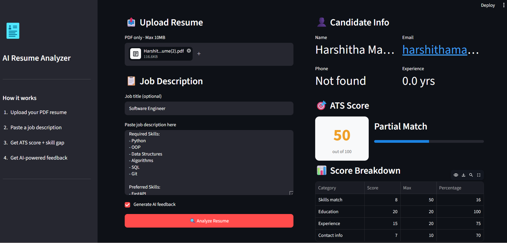
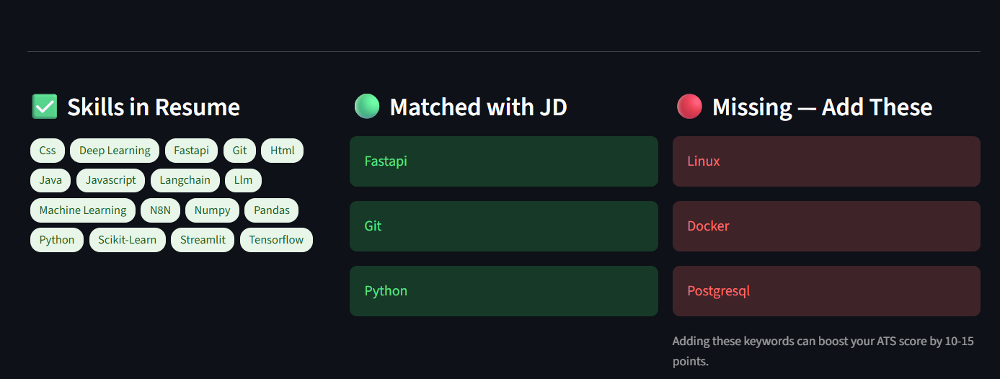
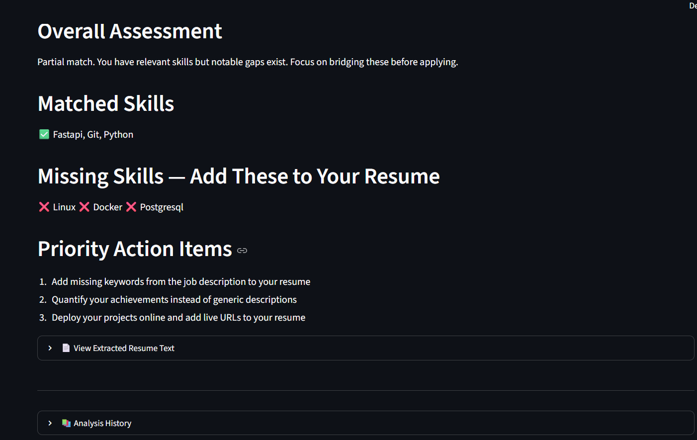

# 📄 AI Resume Analyzer

> **Analyze your resume against any job description in seconds — get ATS score, skill gap analysis, and AI-powered feedback.**


---

## 📸 Screenshots

<!-- Add screenshots after recording -->
### Dashboard


### Skills


### feedback

---

## ✨ Features

- 📤 **Upload PDF resume** — drag and drop any PDF
- 🧠 **NLP-powered parsing** — extracts name, email, phone, skills, education using spaCy
- 🎯 **ATS Score (0-100)** — simulates how recruiters' ATS systems score your resume
- 📊 **Score breakdown** — skills, education, experience, contact info
- 🟢 **Skill gap analysis** — matched skills vs missing skills vs extra skills
- 🤖 **AI feedback** — personalized HR consultant advice using Groq LLM (free)
- 📚 **Analysis history** — saves all past analyses in SQLite

---

## 🛠️ Tech Stack

| Layer | Technology |
|-------|-----------|
| Frontend | Streamlit |
| PDF Parsing | pdfplumber |
| NLP / NER | spaCy (en_core_web_sm) |
| AI Feedback | Groq API (LLaMA3) |
| Storage | SQLite |
| Language | Python 3.10+ |

---

## ⚙️ Run Locally

### 1. Clone the repo
```bash
git clone https://github.com/Harshithamakina/ai-resume-analyzer.git
cd ai-resume-analyzer
```

### 2. Create virtual environment
```bash
python -m venv venv

# Windows
venv\Scripts\activate

### 3. Install packages
```bash
pip install -r requirements.txt
python -m spacy download en_core_web_sm
```

### 4. Add API key (optional but recommended)
Create a `.env` file:
```
GROQ_API_KEY=your-groq-key-here
```
Get free key at: https://console.groq.com

### 5. Run
```bash
streamlit run app.py
```
Open: http://localhost:8501

---

## 📁 Project Structure

```
ai-resume-analyzer/
├── app.py          ← Main Streamlit UI
├── parser.py       ← PDF parsing + spaCy NER
├── scorer.py       ← ATS scoring algorithm
├── feedback.py     ← Groq AI feedback
├── database.py     ← SQLite history
├── requirements.txt
├── .env            ← API keys (not committed)
└── .gitignore
```

---

## 🎯 How It Works

```
Upload PDF → Extract Text (pdfplumber)
         → NLP Parsing (spaCy NER)
         → Skill Matching (vs JD)
         → ATS Scoring (0-100)
         → AI Feedback (Groq LLaMA3)
         → Save History (SQLite)
```

---

## 📊 Scoring Formula

| Category | Max Points |
|----------|-----------|
| Skills match | 50 |
| Education | 20 |
| Experience | 20 |
| Contact info | 10 |
| **Total** | **100** |

